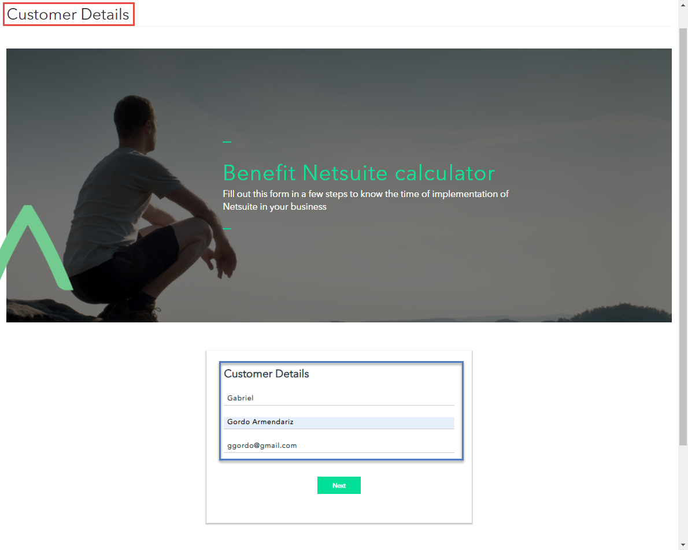
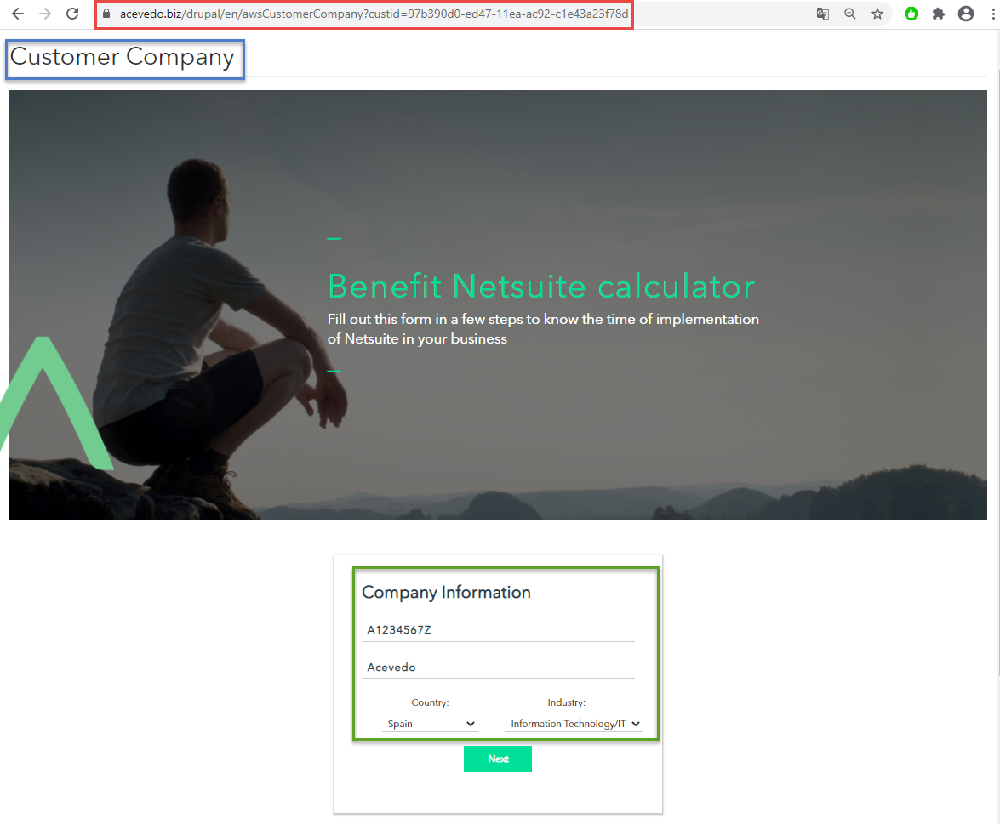
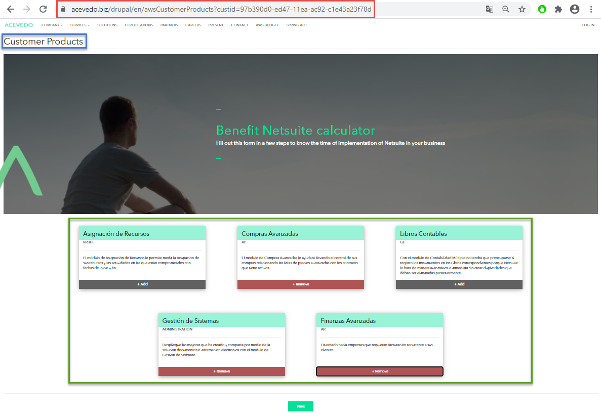
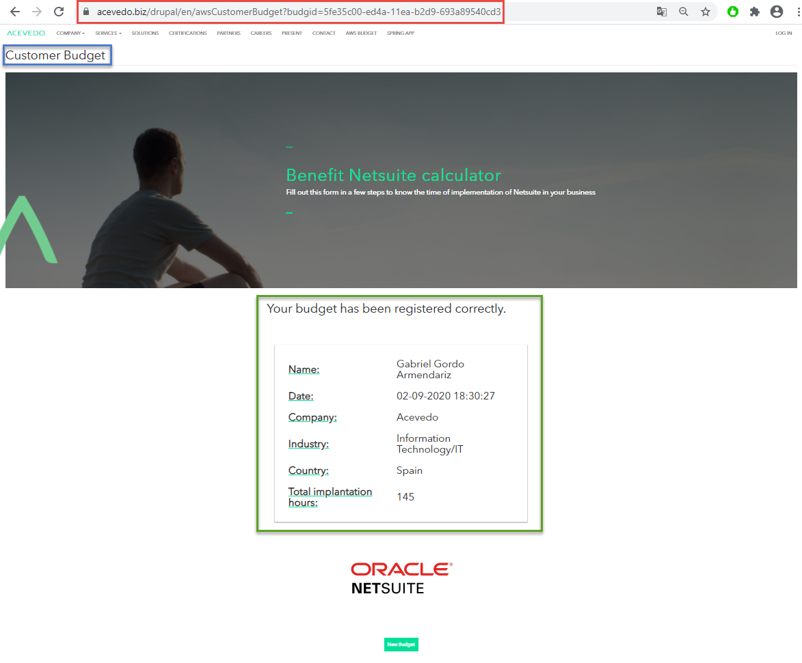

# API WEB - TFM-AWS

### [Go to repository](https://github.com/Gabriel-Acevedo/tfm-aws)

***

## CUSTOMER

_Customer information form_

* ### TEMPLATE: [_customer.html_](https://github.com/Gabriel-Acevedo/tfm-aws/blob/master/src/resources/templates/customer.html)

* ### CSS: [_tfm_aws_main.css_](https://github.com/Gabriel-Acevedo/tfm-aws/blob/master/src/resources/static/css/tfm_aws_main.css)

* ### JAVASCRIPT:
    - #### [_tfm_global_variables.js_](https://github.com/Gabriel-Acevedo/tfm-aws/blob/master/src/resources/static/js/tfm_global_variables.js)
    - #### [_tfm_customerProcesses.js_](https://github.com/Gabriel-Acevedo/tfm-aws/blob/master/src/resources/static/js/tfm_customerProcesses.js)

***	

## SAVE CUSTOMER INFO

_Saves the information of the form and creates a new Customer_

* ### METHOD: POST

* ### URL:  {AWS_URL}/api/customer 

***

## COMPANY

_Customers Company information form_

* ### TEMPLATE: [_company.html_](https://github.com/Gabriel-Acevedo/tfm-aws/blob/master/src/resources/templates/company.html)

* ### CSS: [_tfm_aws_main.css_](https://github.com/Gabriel-Acevedo/tfm-aws/blob/master/src/resources/static/css/tfm_aws_main.css)

* ### JAVASCRIPT:
    - #### [_tfm_global_variables.js_](https://github.com/Gabriel-Acevedo/tfm-aws/blob/master/src/resources/static/js/tfm_global_variables.js)
    - #### [_tfm_companyProcesses.js_](https://github.com/Gabriel-Acevedo/tfm-aws/blob/master/src/resources/static/js/tfm_companyProcesses.js)

***

## SAVE COMPANY INFO

_Saves the information of the form, creates a new Company and adds the new Company to the Customer_

* ### METHOD: POST

* ### URL:  {AWS_URL}/api/{customerid}/company 

***

## PRODUCT

_Product selection form_

* ### TEMPLATE: [_product.html_](https://github.com/Gabriel-Acevedo/tfm-aws/blob/master/src/resources/templates/_product.html)

* ### CSS: [_tfm_product.css_](https://github.com/Gabriel-Acevedo/tfm-aws/blob/master/src/resources/static/css/tfm_product.css)

* ### JAVASCRIPT:
    - #### [_tfm_global_variables.js_](https://github.com/Gabriel-Acevedo/tfm-aws/blob/master/src/resources/static/js/tfm_global_variables.js)
    - #### [_tfm_companyProcesses.js_](https://github.com/Gabriel-Acevedo/tfm-aws/blob/master/src/resources/static/js/tfm_productProcesses.js)

***

## GET PRODUCTS

_Returns the actual products available to be selected by the Customer_

* ### METHOD: GET

* ### URL:  {AWS_URL}/api/products

***

## SAVE NEW BUDGET

_Creates a new budget with the information of the selected products by the Customer_

* ### METHOD: POST

* ### URL:  {AWS_URL}/api/{customerid}/budget

***

## BUDET

_Summary of the Budget_

* ### TEMPLATE: [_budget.html_](https://github.com/Gabriel-Acevedo/tfm-aws/blob/master/src/resources/templates/budget.html)

* ### CSS: [_tfm_aws_main.css_](https://github.com/Gabriel-Acevedo/tfm-aws/blob/master/src/resources/static/css/tfm_aws_main.css)

* ### JAVASCRIPT:
    - #### [_tfm_global_variables.js_](https://github.com/Gabriel-Acevedo/tfm-aws/blob/master/src/resources/static/js/tfm_global_variables.js)
    - #### [_tfm_budgetProcesses.js_](https://github.com/Gabriel-Acevedo/tfm-aws/blob/master/src/resources/static/js/tfm_budgetProcesses.js)

***

## GET BUDGET

_Returns the information of the recently created Budget_

* ### METHOD: GET

* ### URL:  {AWS_URL}/api/budget/{budgetid}

***

### [Go to repository](https://github.com/Gabriel-Acevedo/tfm-aws)