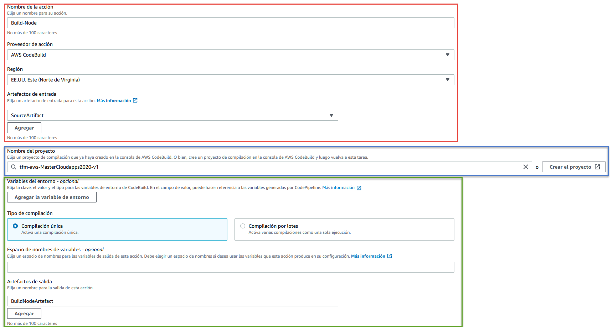

# AWS-Continuous Integration & Continuous Deployment

## CodeBuild & CodePipeline

At first it was proposed for continuous integration to use GitHub Actions. However, after researching the definition and difference between continuous integration and deployment, a more appropriate solution was found allowing to do both. The AWS services that allowed for continuous integration and deployment were CodeBuild and CodePipeline. CodePipeline allows the creation of different stages to implement integration and continuous deployment. These stages can be created using different Amazon services, one of them being CodeBuild. CodeBuild allows the simulation of a virtual machine with the desired operating system and execute in a series of commands, either to compile, analyze the code or to deploy the application.

Due to the security and service restrictions on AWS, before the CodePipeline and CodeBuild can be configured, some IAM roles have to be created and afterwards used in CodePipeline and CodeBuild configuration.

* **CodeBuild:** IAM roles for CodeBuild to allow the access between CodeBuild and other AWS services.

    - **codebuild-tfm-aws-MasterCloudapps2020-v1-service-role:**

    

    - **codebuild-tfm-aws-MasterCloudapps2020-SAM-v1-service-role:**

    

    - **tfm-aws-codebuild-service-role:** 

    

* **CodePipeline:** IAM roles for CodePipeline to allow the access between CodePipeline and other AWS services.

    - **tfm_aws_codepipeline_service_role (Custom Role): [tfm_aws_codepipeline_service_role.json](https://github.com/Gabriel-Acevedo/tfm-aws/blob/master/documentation/images/ci_cd/tfm_aws_codepipeline_service_role.json)**

* **CloudFormation:** IAM roles for CloudFormation to allow the access between CloudFormation and other AWS services.

    - **tfm_aws_cloudformation_s3_role:** 

    

    - **tfm_aws_cloudformation_s3_role (Custom Role): [tfm_aws_cloudformation_s3_role.json](https://github.com/Gabriel-Acevedo/tfm-aws/blob/master/documentation/images/ci_cd/tfm_aws_cloudformation_s3_role.json)**

After the IAM roles creation, CodeBuild configuration is as follows:

* **tfm-aws-MasterCloudapps2020-v1:** CodeBuild that will have the configuration to execute commands to compile node application.

    

    

    

* **tfm-aws-MasterCloudapps2020-SAM-BUILD-v1:** CodeBuild that has the configuration to execute the corresponding commands to only build CloudFormation template using SAM to verify that the syntaxis is correct in the template.

    

    

    

    

* **tfm-aws-MasterCloudapps2020-SAM-v1:** CodeBuild that has the configuration to execute the corresponding commands to build and deploy CloudFormation template.

    

    

    

    

The final step is to create the CodePipeline, which has been divided into the following stages:

* **Source:** This is the first one to be executed and it retrieves the files from GitHub repository and creates output artefacts to be used in subsequent stages.

 

* **Continuous-Integration**: The objective of the second stage "Continuous-Integration" is to execute build for node application and sam template configuration. Normally, in this phase there would have been also a stage to execute unit test, but due to the creation of LAMBDAS with CloudFormation template, unit test can´t be executed on a CloudFormation template.

    

    - **Build-Node:** Action that will compile the node application.

    

    - **Build-SAM:** In this action the template.yaml file will be build, to verify that there is no error in the template.

    

* **Continuous-Delivery**: The objective of this last stage is to deploy the application into production environment.

 

## Analysis of the Application code

Another continuous integration apart from CodePipeline is the analysis of the repository code. This will be done by Sonar Cloud via GitHub Actions when push or pull request are merged into master branch. Sonar Cloud is a service that allows the analysis of project code located in the GitHub repository, performing a thorough analysis of the application and afterwads showing a detailed report of the bugs and problems found.

Before executing the SonarCloud job, there must exist in the repository a sonar-project.properties file, which will help SonarCloud to know the repository to be analysed. After this configuration the job will execute succesfully and show at the SonarCloud console the result of the analysis.

* **Files:**
    - **[sonar-project.properties](https://github.com/Gabriel-Acevedo/tfm-aws/blob/master/sonar-project.properties)**
    - **[sonarcloud.yml](https://github.com/Gabriel-Acevedo/tfm-aws/blob/master/.github/workflows/sonarcloud.yml)**

Example of an excuted analysis of the code:

## Releases

The final continuous integration is a GitHub Actions that will be executed when uploading a tag starting with v or V. This GitHub Actions is composed of a job divided into different stages and will be responsible for backing up the code. The main actions are the creation of a new release, generating a zip file with the application code and uploading this generated zip file to S3 Bucket in AWS, which will be used as an artifact and back up code repository.

* **File:**
    - **[release.yml](https://github.com/Gabriel-Acevedo/tfm-aws/blob/master/.github/workflows/release.yml)**

Example of saved zip file in S3 Bucket:

